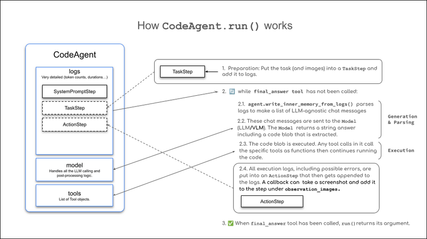

# Unit 2.1 - The smolagents framework

# Introduction to Agentic Frameworks

- **When to Use an Agentic Framework:** The course emphasizes that an agentic framework is **not always necessary**. For simple use cases, predefined workflows or a basic chain of prompts using plain code might be perfectly sufficient, giving developers full control and understanding of their system without added abstractions. However, when workflows become more complex—such as requiring an LLM to call functions or orchestrating multiple agents—the abstractions provided by a framework become highly beneficial.
- **Core Components of a Framework:** To handle these complex workflows, a robust agentic framework generally provides several essential features:
    - An **LLM engine** to power the agent's reasoning.
    - A **list of tools** that the agent can access and use.
    - A **parser** designed to extract tool calls from the LLM's text output.
    - A **system prompt** that is synchronized with the parser.
    - A **memory system** to maintain conversational context.
    - **Error logging and retry mechanisms** to control and recover from LLM mistakes.

# **Why use smolagents ?**

**smolagents** is a simple yet powerful framework used to build AI agents. It provides Large Language Models (LLMs) with the "agency" needed to interact with the real world (such as searching the web or generating images) by generating thoughts based on observations to perform actions.

### **Key Advantages of smolagents**

- **Simplicity:** It features minimal code complexity and few abstractions, making it easy to understand, adopt, and extend.
- **Flexible LLM Support:** It works with any LLM by integrating with Hugging Face tools and external APIs.
- **Code-First Approach:** It offers first-class support for Code Agents that write their actions directly in code, which simplifies tool calling and removes the need for parsing.
- **HF Hub Integration:** It allows for seamless integration with the Hugging Face Hub, including the ability to use Gradio Spaces as tools.

### **When to use smolagents?**

You should choose this framework when:

- You need a **lightweight and minimal solution**.
- You want to **experiment quickly** without dealing with complex configurations.
- Your **application logic is straightforward**.

### **Code vs. JSON Actions**

Unlike many other frameworks that require agents to write actions in JSON formats that must be parsed, `smolagents` **focuses on tool calls written directly in code**. This simplifies the execution process because the output can be executed directly without needing an external parser.

### **Agent Types in smolagents**

Agents in this framework operate as **multi-step agents** that execute one thought and one tool call per step. While the primary agent type is the **`CodeAgent`** (which writes code), the framework also supports the **`ToolCallingAgent`**, which writes standard tool calls in JSON for simpler use cases.

### **Model Integration in smolagents**

The framework provides several predefined classes to flexibly connect to various models and services:

- **`TransformersModel`**: For local transformers pipelines.
- **`InferenceClientModel`**: For serverless inference via Hugging Face or third-party providers.
- **`LiteLLMModel`**: For lightweight model interactions.
- **`OpenAIServerModel` & `AzureOpenAIServerModel`**: For connecting to OpenAI or Azure OpenAI API interfaces.

# Building Agents that Use Code

Code agents are the default type of agent in `smolagents`. They generate Python tool calls to perform actions, offering an efficient, expressive, and accurate approach using a lightweight framework implemented in approximately 1,000 lines of code.

### **Why Code Agents?**

Traditional multi-step agents typically output actions in a JSON format specifying tool names and arguments, which the system must then parse to execute. However, research indicates that LLMs work more effectively when writing actions directly in code. Writing actions in code offers several key advantages:

- **Composability:** Actions can be easily combined and reused.
- **Object Management:** Agents can work directly with complex structures, such as images.
- **Generality:** They can express any task that is computationally possible.
- **Natural for LLMs:** High-quality code already exists abundantly in the training data of LLMs.

### **How Does a Code Agent Work?**



A `CodeAgent` (a specialized `MultiStepAgent`) follows the ReAct framework through a cycle of steps, keeping track of variables and knowledge in an execution log.

1. The system prompt is stored in a `SystemPromptStep` and the user query is logged in a `TaskStep`.

Then, the following while loop is executed:

2.1 Method `agent.write_memory_to_messages()` writes the agent’s logs into a list of LLM-readable [chat messages](https://huggingface.co/docs/transformers/main/en/chat_templating).

2.2 These messages are sent to a `Model`, which generates a completion.

2.3 The completion is parsed to extract the action, which, in our case, should be a code snippet since we’re working with a `CodeAgent`.

2.4 The action is executed.

2.5 The results are logged into memory in an `ActionStep`.

# Multi-Agent Systems

Multi-agent systems allow **specialized agents to collaborate on complex tasks** instead of relying on a single, general-purpose agent. By distributing tasks among agents with distinct capabilities, these systems significantly improve **modularity, scalability, and robustness**.

### **Multi-Agent Systems in Action**

A typical multi-agent architecture consists of multiple specialized agents working together under the coordination of an **Orchestrator Agent** (or Manager Agent) that manages task delegation and interaction. A standard setup in frameworks like `smolagents` might include:

- A **Manager Agent** dedicated to task delegation.
- A **Code Interpreter Agent** dedicated to code execution.
- A **Web Search Agent** dedicated to information retrieval.


Another common application is a **Multi-Agent RAG system**, which might integrate a Web Agent for internet browsing, a Retriever Agent for fetching knowledge base data, and an Image Generation Agent for producing visuals, all coordinated by the orchestrator.

### **Benefits of Splitting Tasks**

Dividing a task among multiple agents using a hierarchical structure offers two major benefits:

- **Better Performance:** Each agent becomes more focused on its specific core task, which makes the overall system more performant.
- **Reduced Token Cost and Latency:** If a single agent handles everything, its context window quickly fills up with detailed search results and data, which slows down the system and ramps up token costs. Separating memories between different sub-tasks reduces the number of input tokens processed at each step.

### **Solving Complex Tasks with a Hierarchy**

When building a multi-agent hierarchy for complex tasks, the **Manager Agent** does the "mental heavy lifting" and planning. It skillfully divides the workload into smaller sub-tasks, assigns them to specialized subordinate agents (like a Web Agent), and then aggregates the returned lists and data to compile the final report or output.

# Example of Multi-Agent

```python
from smolagents import CodeAgent, DuckDuckGoSearchTool, HfApiModel, ManagedAgent

model = HfApiModel(model_id="Qwen/Qwen2.5-Coder-32B-Instruct")

web_agent = CodeAgent(
    tools=[DuckDuckGoSearchTool()],
    model=model,
    name="web_researcher",
    description="Searches the web to find the latest information on any topic."
)

managed_web_agent = ManagedAgent(
    agent=web_agent,
    name="research_specialist",
    description="A specialist that can research any topic on the internet and provide summaries."
)

manager = CodeAgent(
    tools=[], 
    model=model, 
    managed_agents=[managed_web_agent]
)

manager.run("Research the current state of commercial nuclear fusion in 2026 and write a short summary.")
```
