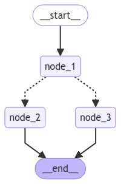

# Unit 2.3 - The LangGraph Framework

Status: Inbox
Pinned: No
Created time: March 20, 2026 8:05 AM
Projects: HuggingFace AI Agent  (https://www.notion.so/HuggingFace-AI-Agent-326dfdb107c680859a4bcfd7b43f71dc?pvs=21)
Archive: No
Settings: comnamcangu (https://www.notion.so/comnamcangu-2eddfdb107c6811d9848cffa963de89c?pvs=21)
Insights: Insights (https://www.notion.so/Insights-2eddfdb107c6818fb904dc611a7e9805?pvs=21)
Total EXP: 0
XP: 💎 +0 XP

# **What is LangGraph?**

LangGraph is a framework developed by LangChain that is specifically designed to manage the control flow of applications integrating a Large Language Model (LLM).

### **Is LangGraph different from LangChain?**

Yes, they are distinct packages that can be used in isolation. LangChain provides standard interfaces to interact with models and components (like retrievers and tools), and while you can use these LangChain classes inside LangGraph, you are not strictly required to do so.

### **Control vs. Freedom (When to use LangGraph?)**

When building AI applications, developers face a trade-off between **freedom** (allowing the LLM to creatively solve unexpected problems) and **control** (ensuring predictable and safe behavior). While smolangents Code Agents offer immense freedom, they can be unpredictable. LangGraph is situated on the opposite end of the spectrum and shines when you need strict **Control** over your agent's execution flow.

You should use LangGraph for:

- Multi-step reasoning processes that require explicit control over the flow.
- Applications that require the persistence of state between different steps.
- Systems combining deterministic (rule-based) logic with AI capabilities.
- Workflows that require human-in-the-loop interventions.
- Complex architectures with multiple components working together.

### **How does LangGraph work?**

At its core, LangGraph structures your application using a directed graph made of three main elements:

- **Nodes:** These represent individual processing steps, such as making an LLM call, using a tool, or making a decision.
- **Edges:** These define the possible paths and transitions between different nodes.
- **State:** A user-defined structure that contains the information flowing through the application; it is maintained and passed between nodes to help determine which node to target next.

### **How is it different from regular Python?**

While you could technically write standard Python code with `if-else` statements to handle application flow, LangGraph provides superior built-in abstractions for building complex systems. It saves you from writing boilerplate code by offering out-of-the-box support for state management, workflow visualization, logging (traces), and built-in human-in-the-loop mechanisms.

# **Building Blocks of LangGraph**

To build applications with LangGraph, you need to understand its core components. A LangGraph application starts from an entrypoint, and depending on the execution, the flow moves from one function to another until it reaches the end. Here are the four fundamental building blocks:

### **1. State**

The **State** is the central concept in LangGraph. It represents all the information that flows through your application. Because the state is entirely user-defined, you must carefully craft its fields to contain all the data needed for the agent's decision-making process.

```python
from typing_extensions import TypedDict

class State(TypedDict):
    graph_state: str
```

### **2. Nodes**

**Nodes** are Python functions that process the data. Each node takes the current state as its input, performs some operation, and returns updates to the state.

```python
def node_1(state):
    print("---Node 1---")
    return {"graph_state": state['graph_state'] +" I am"}

def node_2(state):
    print("---Node 2---")
    return {"graph_state": state['graph_state'] +" happy!"}

def node_3(state):
    print("---Node 3---")
    return {"graph_state": state['graph_state'] +" sad!"}
```

 Nodes can be used to execute:

- **LLM calls:** To generate text or make decisions.
- **Tool calls:** To interact with external systems or APIs.
- **Conditional logic:** To determine the next steps.
- **Human intervention:** To pause and get input directly from users.
*(Note: LangGraph also provides necessary built-in nodes like `START` and `END` to control the overall workflow).*

### **3. Edges**

**Edges** connect your nodes together and define the possible paths through your graph. They determine how the application moves from one step to the next. Edges can be:

- **Direct:** They always go sequentially from node A to node B.
- **Conditional:** They dynamically choose the next node based on the current information in the state.

```python
import random
from typing import Literal

def decide_mood(state) -> Literal["node_2", "node_3"]:
    
    # Often, we will use state to decide on the next node to visit
    user_input = state['graph_state'] 
    
    # Here, let's just do a 50 / 50 split between nodes 2, 3
    if random.random() < 0.5:

        # 50% of the time, we return Node 2
        return "node_2"
    
    # 50% of the time, we return Node 3
    return "node_3"
```

### **4. StateGraph**

The **StateGraph** is the main container that holds your entire agent workflow together. Once you have defined your state, nodes, and edges, you compile them into a `StateGraph`, which can then be visualized (as a graph) and invoked to actually run your application.

```python
from IPython.display import Image, display
from langgraph.graph import StateGraph, START, END

# Build graph
builder = StateGraph(State)
builder.add_node("node_1", node_1)
builder.add_node("node_2", node_2)
builder.add_node("node_3", node_3)

# Logic
builder.add_edge(START, "node_1")
builder.add_conditional_edges("node_1", decide_mood)
builder.add_edge("node_2", END)
builder.add_edge("node_3", END)

# Add
graph = builder.compile()

# View
display(Image(graph.get_graph().draw_mermaid_png()))

graph.invoke({"graph_state" : "Hi, this is Lance."})

### ---Node 1---
### ---Node 3---
### {'graph_state': 'Hi, this is Lance. I am sad!'}
```


